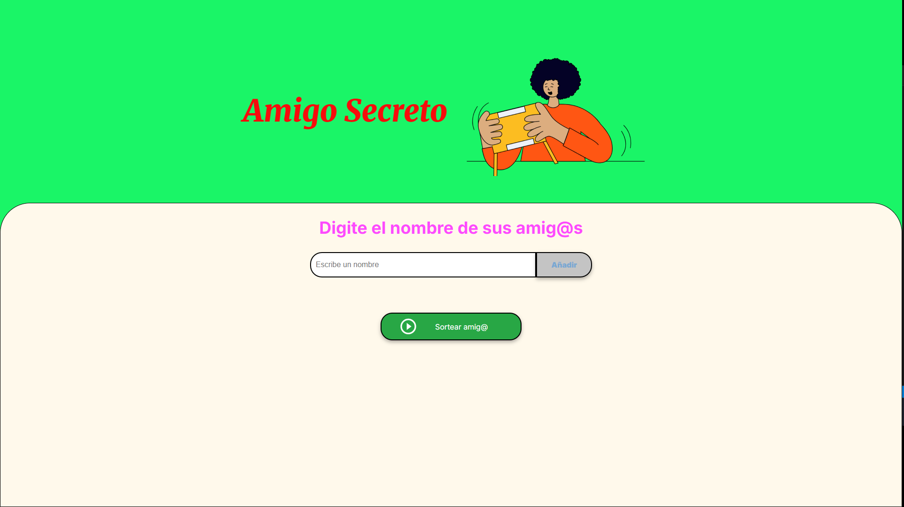
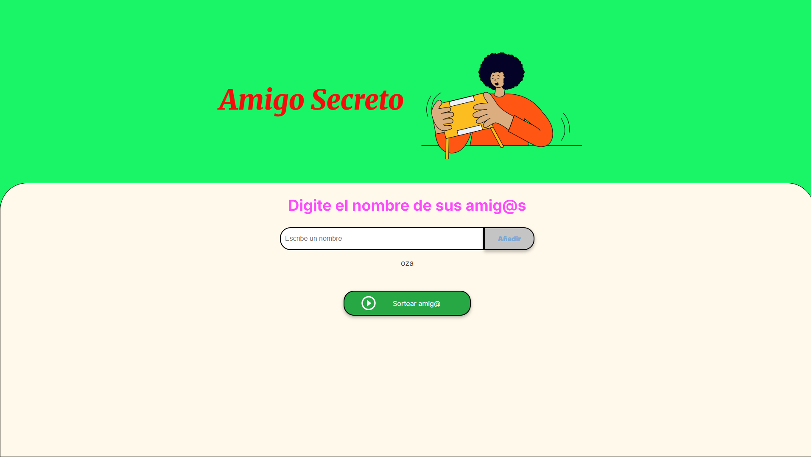
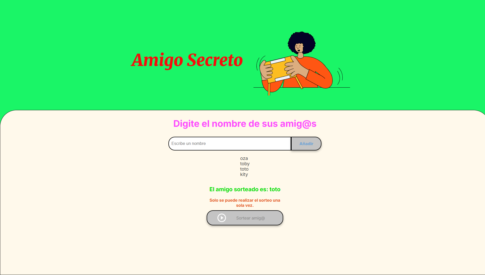

<!--  # challenge-amigo-secreto --> 
<!-- Primer Challenge Alura Latam -->

___
## Primer Challenge Alura Latam 	📚
## "Amigo Secreto" 
___

## Tecnologías empleadas ⚙️

| Tecnologías | Badges |
|-------------|--------|
| HTML5       |  |
| CSS3        |  |
| JavaScript  |  |
| Git         |  |
| GitHub      |  |

___

## Descripción 🔎

Es una aplicación sencilla para organizar un sorteo de un 'amigo secreto'. Permite ingresar nombres de personas y agregarlos a una lista que se muestra en pantalla mediante el botón 'Añadir'. Por último, al presionar el botón "Sortear amig@", se obtiene un nombre seleccionado al azar.
___
## Instalación 🔧

Este proyecto es una aplicación web sencilla que funciona directamente en el navegador, por lo que no requiere instalación previa.

Para ejecutar la aplicación, sigue estos pasos:

1. Descarga o clona el repositorio en tu máquina.
2. Navega a la carpeta del proyecto `challenge-amigo-secreto`.
3. Abre el archivo `index.html` con tu navegador web preferido (puedes hacer doble clic sobre el archivo o abrirlo desde el navegador).

¡Y listo! Así podrás usar la aplicación.

---

**Nota:**  
Si prefieres, puedes servir el proyecto con un servidor local para evitar posibles problemas con la carga de algunos recursos, por ejemplo usando la extensión **Live Server** de Visual Studio Code.
___
## Uso 🗝️

* Ingresa los nombres de las personas en el campo correspondiente.

* Presiona el botón "Añadir" para agregarlos a la lista.

* Una vez añadidos todos los nombres, pulsa el botón "Sortear amigo" para obtener un nombre al azar.
___
## Características 📢

* Agrega nombres a una lista de participantes.

* Sortea un nombre al azar con solo presionar un botón.

* Interfaz sencilla e intuitiva.
___
## Imagenes

___
## Desafios 🎯
* Se modificaron los colores del body; título; botones.
* Se realizo el control de que solo se pueden ingresar letras, sin simbolos especiales.
* Se puede ingresar mas de un nombre, agregando un  espacio en blanco entre ellos.
* Se realizo la opción de que no se puede usar el botón de sorteo, mas de una vez.
* Se agrego un mensaje con el uso de timeoutMensaje, cuando el usuario, preciona el boton de ‘sorteo’ mas de una vez.

* Se modifico los hover de los btn, para que se vean mas realistas.
___
## Contribuciones 🔥

¡Las contribuciones son bienvenidas!

Si deseas mejorar el proyecto, por favor sigue estos pasos:

1. Haz un fork del repositorio.
2. Crea una rama nueva con tus cambios: `git checkout -b mi-nueva-funcionalidad`
3. Realiza tus mejoras o correcciones.
4. Haz commit a tus cambios: `git commit -m 'Agrega una nueva funcionalidad'`
5. Sube tu rama: `git push origin mi-nueva-funcionalidad`
6. Abre un Pull Request detallando tus cambios.

Si encuentras algún problema, no dudes en crear un issue. Todos los aportes y sugerencias son apreciados. ¡Gracias por ayudar a mejorar Amigo Secreto!
___
## Licencia 🚨

Este proyecto está bajo la **Licencia MIT**. Esto significa que puedes usar, copiar, modificar, fusionar, publicar, distribuir, sublicenciar y/o vender copias del software, siempre que incluyas el aviso de copyright y esta licencia en todas las copias o partes sustanciales del software.

El software se proporciona **"tal cual"**, sin garantía de ningún tipo, explícita o implícita, incluyendo pero no limitado a garantías de comerciabilidad o aptitud para un propósito particular. En ningún caso los autores serán responsables de ningún reclamo, daño u otra responsabilidad derivada del uso del software.
___
## Contacto 🌎

Puedes contactarme a través de mi perfil de LinkedIn:  
**Christian Ariel Garay**   

___
